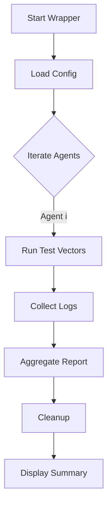

# STRESS_TEST_GUIDE.md

## Overview
The **Ultimate Agent Stress Test Suite v2.0** validates ten agents across five orthogonal test vectors. Each vector stresses a different aspect of the agent runtime:

| Test Vector | Purpose | Stress Type |
|------------|---------|------------|
| **StateConsistency** | Verify that agents maintain a coherent internal state across asynchronous events. | Logical state churn |
| **CrossAgentComm** | Exercise inter‑agent messaging, shared resources, and race conditions. | Communication bandwidth |
| **FailureInjection** | Randomly inject recoverable and non‑recoverable failures (timeouts, process crashes, bad exits). | Fault tolerance |
| **ResourceContention** | Saturate CPU, memory, and I/O (large file writes, infinite loops, `dd` streams). | Resource exhaustion |
| **StateMachineValidation** | Run each agent through a deterministic state‑machine checklist ensuring proper transitions. | Workflow correctness |

## Agents
| Agent | Core Capability | Primary Stress Focus |
|------|----------------|--------------------|
| **XORAS** | Bitwise manipulation engine | ResourceContention |
| **Nova** | CI/CD pipeline orchestrator | FailureInjection |
| **Vance** | API gateway | CrossAgentComm |
| **Aurelius** | Data‑analytics worker | StateConsistency |
| **Evan** | Event‑driven microservice | StateMachineValidation |
| **Clara** | Configuration manager | FailureInjection |
| **Dr. Jeremy** | Diagnostic logger | ResourceContention |
| **LEX CORE** | Natural‑language interpreter | CrossAgentComm |
| **Prism** | Graph traversal engine | StateConsistency |
| **Atlas** | Distributed storage coordinator | StateMachineValidation |

## Execution Flow (Mermaid Diagram)


## How to Run
1. **Compile** (if you edit the JS): `npm run build` (this project ships a pre‑compiled `agent-stress-suite.js`).
2. **Execute** one‑liner:
   ```bash
   bash ./run-stress-test.sh   # or node ./agent-stress-suite.js
   ```
3. **Outputs**
   - Real‑time console progress.
   - Detailed timeline in `/tmp/stress-test-full.log`.
   - Human‑readable markdown report in `/tmp/stress-test-report.md`.
4. **Interpretation**
   - Pass/Fail per **agent** and **vector** is highlighted.
   - Resource usage graphs (CPU, RSS) are embedded in the report.
   - Any non‑recoverable failure aborts the suite and is flagged.

## Cleanup
The wrapper automatically deletes the temporary directory after the run. Manual cleanup can be performed with:
```bash
rm -rf /tmp/stress-test-*
```

---
*Prepared by Antigravity – a powerful, agentic AI coding assistant.*
