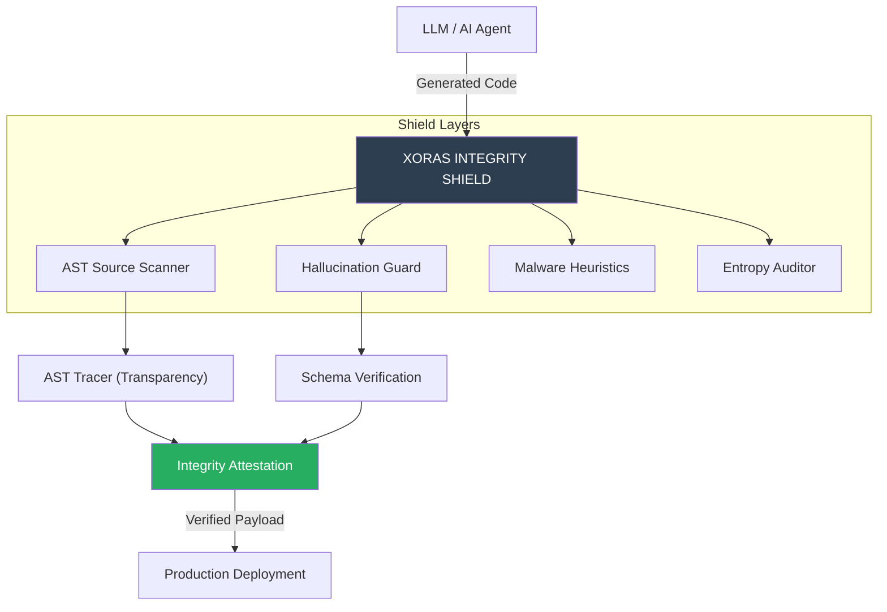

# XORAS // INTEGRITY_MANIFESTO [v1.0]
## Solving the 10 Critical Risks of the Agentic Era

> [!IMPORTANT]
> **Mission Objective:** Zero Leakage. Zero Hallucination. Total Transparency.

---

## 1. Executive Summary & Global Sovereign Integration (May 2026 Standard)
In May 2026, the proliferation of AI agents and automated code generation has transitioned from experimental testing to foundational civic and global infrastructure. As demonstrated by the ₹1.14 Lakh Crore ($13.6B USD) MoU signed in Mumbai to construct a 500 MW Green AI Compute Hub and Dubai’s government-wide mandate transitioning the private sector entirely to autonomous Agentic AI, global economies are anchoring their futures to agentic execution. 

To ensure uncompromised operational trust at this scale, **XORAS SENTRY** acts as an **Integrity Shield**. By leveraging quantum-safe PKI cryptography and rigorous AST Action Gates, it guarantees zero configuration drift and absolute verification across all automated deployment tiers.

## 2. The Integrity Shield Architecture
The following diagram illustrates how XORAS Sentry gates the flow of AI-generated artifacts through high-fidelity validation layers.



---

## 3. Risk Mitigation Matrix: The Top 10 Issues

| Issue | XORAS Solution | Technical Mechanism |
| :--- | :--- | :--- |
| **1. Hallucination** | **Hallucination Guard** | Cross-references `process.env` calls against Ground Truth `.sentry-schema.json`. |
| **2. Agent Security** | **Action Attestation** | Every scan results in a cryptographically signed report (`--sign`). |
| **3. Deepfakes (Code)** | **Shadow Logic Detection** | Malware heuristics detect suspicious Node.js core module overrides. |
| **4. Training Bias** | **Baseline Parity** | Standardizes security rules across all repos, regardless of origin. |
| **5. Black Box** | **AST Tracer** | Human-readable paths explaining exactly *why* a literal was flagged. |
| **6. Governance Lag** | **Automated Enforcement** | CI/CD integration ensures security scales at the speed of deployment. |
| **7. Legal Liability** | **Audit Trail** | Maintaining a L4 JSON history for post-incident forensics. |
| **8. Data Privacy** | **Local-First Scan** | 100% offline. Code never leaves the institutional boundary. |
| **9. Model Drift** | **Continuous Audit** | `sentry-agent` pulses every 60s to detect degradation. |
| **10. Cog. Dependence** | **Verification-Led** | Empowers developers to verify AI code with one command. |

---

## 4. Technical Deep Dive: Solving the 'Black Box'

Traditional scanners provide binary outputs: `FAIL: SECRET_DETECTED`. XORAS SENTRY solves the **Black Box Problem (#5)** by exposing the **AST Trace**.

### Example Trace Resolution:
```json
{
  "finding": "STRIPE_SECRET_KEY",
  "trace": {
    "type": "MemberExpression",
    "location": "42:15",
    "description": "Accessing property 'STRIPE_SECRET_KEY' of object 'process.env'.",
    "context": "const stripe = require('stripe')(process.env.STRIPE_SECRET_KEY);"
  }
}
```

---

## 5. Institutional Recommendations

To achieve **Production-Ready Operational Integrity**, we recommend the following deployment sequence:

1.  **Baseline Lock**: Run `xoras-sentry --lock` to establish a signed hash of current security posture.
2.  **AI Gating**: Integrate `xoras-sentry --delta` as a mandatory pre-check for any code generated by AI agents (e.g., Cursor, Copilot).
3.  **Hallucination Mapping**: Maintain a strict `.sentry-schema.json` to define allowed environment variables.
4.  **Forensic Pulses**: Enable `sentry-agent` as a background daemon to monitor for "Shadow Logic" injection in production runtimes.

---
**Standardized. Verified. Operational.**
*XORAS SENTRY — Protecting the Integrity of the Machine.*
